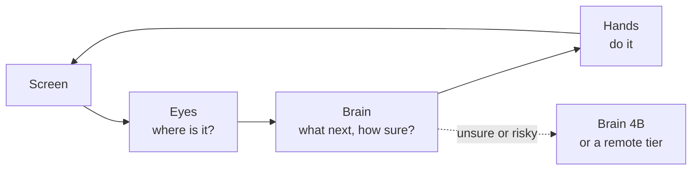

<p align="center">
  <picture>
    <source media="(prefers-color-scheme: dark)" srcset="brand/social/README-bilingual-dark.svg">
    
  </picture>
</p>

<p align="center">
  <b>DeskMind · 得心</b><br>
  A quiet, reliable desktop companion: open-source models and tools that let an agent see your screen, decide the
  next step, and act on your own computer.<br>
  <a href="README.zh-CN.md">中文</a> · <a href="BRAND.md">Brand</a>
</p>

---

***得心，应手。*** 得心 comes from the idiom 得心应手: *what the mind decides, the hand carries out*. DeskMind splits a
computer-use agent into three roles plus a benchmark, and each one can be used on its own:

| | Project | What it does | Status |
|---|---|---|---|
| <picture><source media="(prefers-color-scheme: dark)" srcset="brand/family/eyes-lockup-dark.svg"></picture> | [**eyes**](https://github.com/deskmind-ai/eyes) | Finds the target on a screenshot (visual grounding) | code and results; weights soon |
| <picture><source media="(prefers-color-scheme: dark)" srcset="brand/family/brain-lockup-dark.svg"></picture> | [**brain**](https://github.com/deskmind-ai/brain) | Decides the next step with calibrated confidence (typed decisions, MLX) | models on [🤗 deskmind](https://huggingface.co/deskmind) |
| <picture><source media="(prefers-color-scheme: dark)" srcset="brand/family/hands-lockup-dark.svg"></picture> | [**hands**](https://github.com/deskmind-ai/hands) | Drives the real macOS desktop; collects and labels trajectories | available |
| 📐 | [**bench**](https://github.com/deskmind-ai/bench) | Sandbox desktop tasks and graders, with reference runs | suite v23 |



## Principles

- **Local first.** The models run on your Mac with MLX, and your screen stays on your machine by default.
- **Calibrated, not chatty.** Each step is a typed question answered with probabilities. Low confidence means ask,
  escalate or wait, not guess.
- **Measured on the real desktop.** Every claim comes with a reproducible bench run, including where we lose.

## Where we are (September 2026)

On the real macOS desktop (bench v23, 13 tasks × 3 runs, strict pass; 38 runs scored, one environment failure per system):

| | pass | false "done" | time per step (p50) |
|---|---|---|---|
| Jev (cloud reference) | 87% | 2 | 0.36 s |
| **DeskMind** (0.8B → 4B router, 8-bit, M4 Pro) | **92%** | **0** | **0.59 s** |

On the 231 public JevBench v1.4.2 items (the board's `public_accuracy`), DeskMind Brain 4B scores 0.866, the same as Jev 1.13; the sealed-set score is pending. Details and known gaps are in
[brain/docs/results.md](https://github.com/deskmind-ai/brain/blob/main/docs/results.md).

## Try it

On an Apple Silicon Mac:

```bash
git clone https://github.com/deskmind-ai/brain && cd brain
uv sync --extra mlx
uv run hf download deskmind/brain-4b --local-dir models/brain-4b
uv run hf download deskmind/brain-0.8b --local-dir models/brain-0.8b
uv run deskmind-brain-serve --predictor mlx:models/brain-0.8b --escalate-to mlx:models/brain-4b --two-stage --port 8793
```

Then drive the desktop with [hands](https://github.com/deskmind-ai/hands) pointed at `http://127.0.0.1:8793`, and
measure it with [bench](https://github.com/deskmind-ai/bench).

## Meet Xiaofang (小方)

<p>
  
  
  
  
  
  
  
  
</p>

The frame from our logo, come to life. Stickers and assets are in [`brand/`](brand), and usage rules are in
[BRAND.md](BRAND.md).

## License

- Code lives in each project's repository under Apache-2.0.
- Text in this repository is CC BY 4.0.
- The DeskMind and 得心 names, the logo and Xiaofang are covered by [BRAND.md](BRAND.md).
