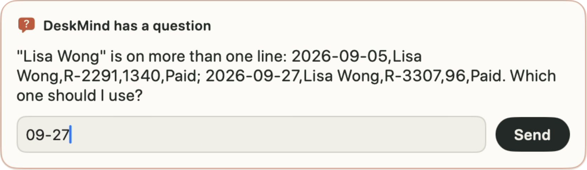
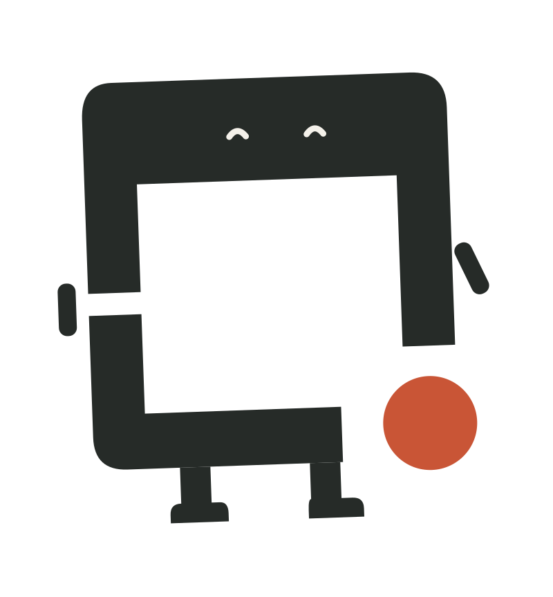

<p align="center">
  <picture>
    <source media="(prefers-color-scheme: dark)" srcset="brand/social/README-bilingual-dark.svg">
    
  </picture>
</p>

# DeskMind · 得心

**小到能在你的 Mac 上跑，聪明到知道该问你。**

DeskMind 得心是全栈开源的 Computer Use Agent。DeskMind 会看屏幕、想下一步、动手操作，靠的全是跑在你 Mac 上的小模型。任务有两种理解时，它先问你一句，不瞎猜。

[English](README.md) · [官网](https://deskmind.dev/zh/) · [文档](https://deskmind.dev/zh/docs/) · [下载 Mac App](https://github.com/deskmind-ai/deskmind/releases/latest) · [模型](https://huggingface.co/deskmind) · [讨论区](https://github.com/deskmind-ai/deskmind/discussions) · [路线图](ROADMAP.md) · [更新日志](CHANGELOG.zh-CN.md)

**[在 deskmind.dev 观看 56 秒演示](https://deskmind.dev/zh/)**：发布版模型的真实录屏。两笔订单都叫 Lisa Wong，所以它先问用哪一笔，再写入。

<p align="center"><a href="https://deskmind.dev/zh/"></a></p>

它是怎么做出来的、路上踩了哪些坑：[三周、二十轮训练、600 美元](https://deskmind.dev/zh/blog/launch/?ref=gh)。如果你觉得 DeskMind 有用或有意思，给这个仓库点个 star，能让更多人看到它。

## 和别的 Computer Use Agent 有什么不同

**小模型，就在你的 Mac 上。** 每一步先由 0.8B 判断，没把握的交给 4B 重新判断。两个模型都在本机运行，不走云端，也不按次付费。0.8B 判断约 0.5 秒，4B 约 3.6 秒（决策时间中位数）。

**System One：选择，不是猜。** 每一步是一道选择题。模型给每个选项打分而不是写文字，所以每个选项都有概率。没把握就交给 4B 或先问你，任何 agent 都能通过 `POST /v1/systemone` 接入。在 39 次真机运行中，它一次也没有在任务没做完时说「完成」。

**从眼到手，全部开源。** Eyes、Brain、Hands 和 Mac App 全部开源，连同给它们打分的 Bench。下面每个成绩都附样本量，可以自己复现。

## 开始使用

**用 Mac App。** [下载 DeskMind for Mac](https://github.com/deskmind-ai/deskmind/releases/latest)（macOS 15 及以上，Apple Silicon，已签名并公证）。App 内置 G18b 发布模型。首次运行会下载模型（约 5.3 GB），并一步步引导你授予权限：[安装 App](https://deskmind.dev/zh/docs/start/install-the-app/)。

**或者自己跑模型。** 下面单独运行 4B（发布版 G18b）。它回答桌面任务中的一步，本身不会去操作桌面。

```bash
# 终端 1：获取 Brain 和模型，然后启动服务
git clone https://github.com/deskmind-ai/brain && cd brain && uv sync --extra mlx
uv run hf download deskmind/brain-4b --revision g18b-q8 --local-dir models/brain-4b
uv run deskmind-brain-serve --predictor mlx:models/brain-4b --port 8793 --two-stage
```

4B 下载约 4.5 GB。如果报 `CAS Client Error`，在下载命令前加 `HF_HUB_DISABLE_XET=1` 重试。在中国大陆可以从 ModelScope 下载同样的文件：
`uvx modelscope download --model gxcsoccer/brain-4b --revision g18b-q8 --local-dir models/brain-4b`。

```bash
# 终端 2（同一个 brain 目录）：让它给出一个真实桌面任务的下一步
curl -s localhost:8793/v1/systemone -H 'Content-Type: application/json' -d @examples/request.json
```

成功时返回带类型的决定，每个选项都有概率，例如
`{"answers": {"operation": {"choice": "CLICK", "probabilities": {"CLICK": 0.96, "OPEN": 0.005, …}}, "click_target": {…}}}`。
概率是模型对各选项的权衡，不保证这一步一定正确。

**发布形态的路由（0.8B → 4B）：** 另外把 `deskmind/brain-0.8b --revision g18b-q8` 下载到 `models/brain-0.8b`（0.8 GB），然后启动
`uv run deskmind-brain-serve --predictor mlx:models/brain-0.8b --escalate-to mlx:models/brain-4b --two-stage --port 8796`。
门槛（0.96）随权重一起发布；每次返回会多一条 `routing` 记录，例如 `{"by": "strong", "reason": "low_conf", "fast_conf": 0.956}`。

逐步说明和返回内容的解读见[快速上手](https://deskmind.dev/zh/docs/start/quickstart/)。要让它真正操作桌面，加上 [Hands](https://github.com/deskmind-ai/hands)。

## 组成

| | 负责 | |
|---|---|---|
| [Eyes](https://github.com/deskmind-ai/eyes) | 在屏幕上找到目标 | 4B 视觉定位模型，用于没有 accessibility tree 的应用 |
| [Brain](https://github.com/deskmind-ai/brain) | 决定下一步 | 0.8B 和 4B，MLX，0.8B → 4B 路由，`/v1/systemone` |
| [Hands](https://github.com/deskmind-ai/hands) | 观察并操作 macOS | 辅助功能与视觉两种模式、执行预算、取消 |
| [App](app/)（本仓库） | 带到你的 Mac 上 | 原生应用加后台助手；[下载](https://github.com/deskmind-ai/deskmind/releases/latest) |
| [Bench](https://github.com/deskmind-ai/bench) | 检查是否真的完成 | 沙箱桌面任务，严格检查最终状态的评分程序 |

模型：[huggingface.co/deskmind](https://huggingface.co/deskmind)（`brain-0.8b`、`brain-4b`、`eyes-4b`）。官网：[deskmind.dev](https://deskmind.dev/zh/)。文档：[deskmind.dev/zh/docs](https://deskmind.dev/zh/docs/)。

## 本仓库里有什么

| 路径 | 内容 |
|---|---|
| [`app/`](app/) | Mac App 的源码（Swift）和构建脚本；[自己构建](app/README.zh-CN.md) |
| [`docs/`](docs/) | [App、后台助手和本地模型服务怎么配合](docs/architecture.md) |
| [`brand/`](brand/) | Logo、小方和分享图；使用规则见 [BRAND.zh-CN.md](BRAND.zh-CN.md) |
| [`.github/workflows/app.yml`](.github/workflows/app.yml) | CI：App 的每次改动都会构建和测试；打版本标签时签名、公证并生成发布草稿 |
| [`ROADMAP.md`](ROADMAP.md) | 接下来在做什么 |

Mac App 的发布版本都在这里：[Releases](https://github.com/deskmind-ai/deskmind/releases)；每个版本改了什么，简要列在 [更新日志](CHANGELOG.zh-CN.md)。

## 成绩，附样本量

| 项目 | 条件 | 结果 |
|---|---|---|
| 真实桌面任务 | Bench v25，13 个任务 × 3 次，严格评分；G18b 路由（0.8B → 4B，8 位，门槛 0.96），通过 App 运行，一台 M4 Pro（48 GB） | **39/39** 通过；没做完却说完成 **0** 次 |
| 决策时间 | 同样 39 次运行，208 次决策 | 0.8B 直接回答时中位数 **0.48 秒**（约 30% 的步骤），交给 4B 时 **3.6 秒**（约 70%）；整体 2.85 秒，最慢 5% 为 9.82 秒。指单次决策，不是整项任务 |
| 决策质量 | JevBench v1.4.2，231 道公开题 | Brain 4B **0.835** · Brain 0.8B 0.723 · 路由 0.797；密封题成绩待出 |
| 视觉定位 | ScreenSpot-Pro，1,581 题，单次推理 | Eyes 4B 在 GPU 上 **67.7%**（bf16，原始分辨率；基座模型 64.8%）；Mac App 实际设置下 **50.9%**（4 位 MLX，≤ 200 万像素） |

- **样本不大。** 13 个任务，一台 Mac，中文系统语言。同一任务的结果高度一致（几乎每个任务都是 3/3 或 0/3），所以有效样本更接近 13 个任务，而不是 39 次运行。
- **有一个任务不算干净。** 中文精确文本任务的 3 次运行里，文件都写对了，但模型一直没说「完成」，用满了步数预算。评分只看最终状态，所以算通过。
- **G18b 用一部分通用判断换来了桌面上的可靠。** 4B 的 JevBench 公开题成绩从 0.866（G14）降到 0.835，主要降在 hard 档。上一版 G14 在同一评测上是 36/39。
- **Eyes 的 GPU 成绩不等于 App 里的配置。** App 用的是 4 位 MLX 版本、最高 2 MP 输入，这个配置还没有基准分数。

以上都是我们自己的运行结果。方法和完整表格见 [Brain 成绩](https://github.com/deskmind-ai/brain/blob/main/docs/results.zh-CN.md) · [Bench 参考结果](https://github.com/deskmind-ai/bench/blob/main/results/reference.md) · [Eyes 成绩](https://github.com/deskmind-ai/eyes/blob/main/docs/results.zh-CN.md) · [成绩与局限](https://deskmind.dev/zh/docs/explanation/results-and-limits/)。

## 还做不好的

- 抄写长表格（超过约四行），或只抄符合条件的行。
- 根据拍照的收据填写表单。
- 交给 4B 的步骤要几秒钟，而目前大部分步骤都会交给 4B。

接下来要做的事见[路线图](ROADMAP.md)。

## 思考在你的 Mac 上完成

默认在本机推理。模型只下载一次，来源是 Hugging Face 或 ModelScope；之后每一步决策都不需要联网。云端模型需要你自己接：App 不会调用云端模型，但如果你自己把路由的升级层指向云端模型，交给它的步骤会发送到那个服务。DeskMind 操作的网页或音乐应用，仍会和各自的服务器通信。

## 参与贡献

- 提问和设计讨论：[讨论区](https://github.com/deskmind-ai/deskmind/discussions)。
- 跨组件的问题、复现报告和项目方向：[在这里提 issue](https://github.com/deskmind-ai/deskmind/issues)，所有组件的问题都提在这里（用 `area: …` 标签区分）。PR 提到代码所在的仓库。
- 可以从哪里帮忙、好的报告包含什么：[参与贡献](https://deskmind.dev/zh/docs/project/contributing/)。和我们数字不一致的复现结果同样欢迎。
- 安全问题请不要公开提交，见 [SECURITY.md](https://github.com/deskmind-ai/.github/blob/main/SECURITY.md)。

## 认识小方



小方是 logo 里的方框活了过来。素材在 [brand/](brand/)，规则见 [BRAND.zh-CN.md](BRAND.zh-CN.md)。

## 许可

- 本仓库的代码（`app/` 下的 Mac App 和 CI）：[Apache-2.0](LICENSE)，另见 [NOTICE](NOTICE)。
- 本仓库的文字和文档：[CC BY 4.0](LICENSE-docs)。
- **不在这两个许可范围内：** DeskMind 和「得心」这两个名称、DeskMind logo、小方这个角色，以及 [brand/](brand/) 下的其他文件。它们的使用规则见 [BRAND.zh-CN.md](BRAND.zh-CN.md)。
- Eyes、Brain、Hands 和 Bench 在各自的仓库中，采用 Apache-2.0；以各仓库的 LICENSE 和 NOTICE 为准。
- 模型权重、基座模型和数据集遵循各自的条款。
