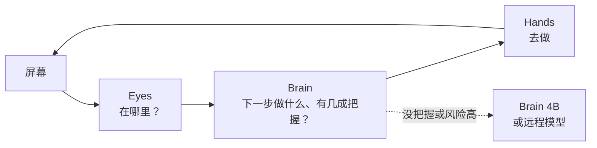
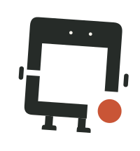
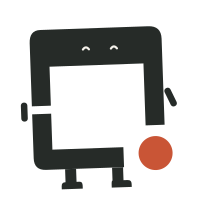
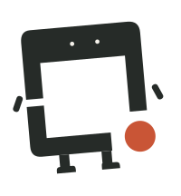
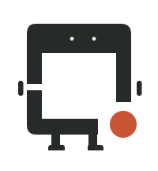
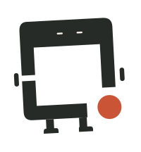

<p align="center">
  <picture>
    <source media="(prefers-color-scheme: dark)" srcset="brand/social/README-bilingual-dark.svg">
    
  </picture>
</p>

<p align="center">
  <b>得心 · DeskMind</b><br>
  一个安静、可靠的桌面伙伴：一组开源模型和工具，让 agent 在你自己的电脑上看懂屏幕、想好下一步、稳稳做到。<br>
  <a href="README.md">English</a> · <a href="BRAND.zh-CN.md">品牌规范</a>
</p>

---

**得心，应手。** 「得心」取自「得心应手」：心里想到，手上就做到。DeskMind 把电脑操作 agent 拆成三个角色，外加一套评测，每一部分都可以单独使用：

| | 项目 | 做什么 | 状态 |
|---|---|---|---|
| <picture><source media="(prefers-color-scheme: dark)" srcset="brand/family/eyes-lockup-dark.svg"></picture> | [**eyes**](https://github.com/deskmind-ai/eyes) | 在截图里找到要操作的目标（视觉定位） | 代码和成绩已公开，权重即将发布 |
| <picture><source media="(prefers-color-scheme: dark)" srcset="brand/family/brain-lockup-dark.svg"></picture> | [**brain**](https://github.com/deskmind-ai/brain) | 决定下一步，并给出把握有多大（带类型的决策，MLX 本地运行） | 模型见 [🤗 deskmind](https://huggingface.co/deskmind) |
| <picture><source media="(prefers-color-scheme: dark)" srcset="brand/family/hands-lockup-dark.svg"></picture> | [**hands**](https://github.com/deskmind-ai/hands) | 驱动真实的 macOS 桌面，采集并标注操作轨迹 | 可用 |
| 📐 | [**bench**](https://github.com/deskmind-ai/bench) | 沙箱桌面任务和评分器，附参考成绩 | 测试集 v23 |



## 原则

- **本地优先。** 模型用 MLX 在你的 Mac 上运行，屏幕内容默认留在本机。
- **给把握，不给废话。** 每一步都是一个带类型的问题，用概率来回答。没把握的时候就去问用户、交给更强的模型或者等一等，不瞎猜。
- **在真实桌面上说话。** 每个结论都附带可复现的测试结果，输给别人的地方也照实写。

## 现在的水平（2026 年 9 月）

真实 macOS 桌面（bench v23，13 个任务 × 3 轮，按严格标准判定通过；两边各有 1 轮环境故障不计分，共 38 轮计分）：

| | 通过率 | 没做完就说完成 | 每步耗时（中位数） |
|---|---|---|---|
| Jev（云端参照） | 87% | 2 | 0.36 秒 |
| **得心**（0.8B → 4B 路由，8 位，M4 Pro） | **92%** | **0** | **0.59 秒** |

在 JevBench v1.4.2 的 231 道公开题上（榜单的 `public_accuracy`），DeskMind Brain 4B 得 0.866，与 Jev 1.13 相同；密封题成绩待出。详细数据和已知不足见
[brain/docs/results.zh-CN.md](https://github.com/deskmind-ai/brain/blob/main/docs/results.zh-CN.md)。

## 试一试

在 Apple 芯片的 Mac 上：

```bash
git clone https://github.com/deskmind-ai/brain && cd brain
uv sync --extra mlx
uv run hf download deskmind/brain-4b --local-dir models/brain-4b
uv run hf download deskmind/brain-0.8b --local-dir models/brain-0.8b
uv run deskmind-brain-serve --predictor mlx:models/brain-0.8b --escalate-to mlx:models/brain-4b --two-stage --port 8793
```

然后让 [hands](https://github.com/deskmind-ai/hands) 连到 `http://127.0.0.1:8793` 去操作桌面，再用 [bench](https://github.com/deskmind-ai/bench) 测成绩。

## 认识小方

<p>
  
  
  
  
  
  
  
  
</p>

小方是我们 logo 里的那个方框活了过来。贴纸和素材在 [`brand/`](brand)，使用规范见 [BRAND.zh-CN.md](BRAND.zh-CN.md)。

## 许可

- 代码在各项目自己的仓库里，采用 Apache-2.0。
- 本仓库的文字采用 CC BY 4.0。
- 「DeskMind」「得心」这两个名称，以及 logo 和小方，按 [BRAND.zh-CN.md](BRAND.zh-CN.md) 使用。
