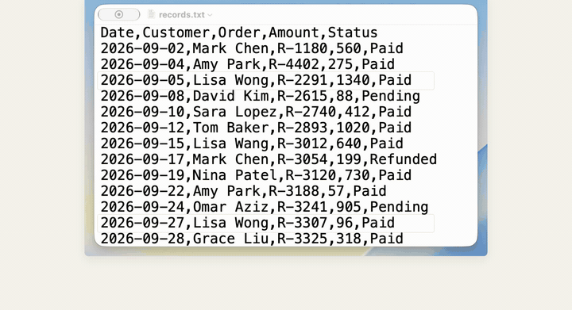

# DeskMind for Mac

[English](README.md)

> 这个目录是 Mac App 的源码。DeskMind 是什么、各部分怎么配合，先看[主 README](../README.zh-CN.md)。

DeskMind 是一个运行在本地的 macOS 电脑操作智能体。输入一个目标（"新建一个叫 Receipts 的文件夹，把 expenses.csv
移进去"、"打开 Safari，搜索新加坡的天气"），确认它可以使用哪些应用，它就替你操作这些应用。发送、删除之类的操作
会先征得你的同意；拿不准时会问你；每一步做了什么、为什么这么做，都会显示出来。

规划模型和视觉模型通过 MLX 在你的 Mac 上运行，屏幕上的内容不会被上传。

**[下载 DeskMind Mac 版](https://github.com/deskmind-ai/deskmind/releases/latest)** · macOS 15+ · Apple 芯片 · 已签名并经 Apple 公证



*真实运行：有两行都符合目标，DeskMind 先问你用哪一笔，而不是自己猜。*

## 上手

1. 从 [Releases](https://github.com/deskmind-ai/deskmind/releases/latest) 下载最新的 `DeskMind-<版本>.dmg`，打开后把 DeskMind 拖进“应用程序”。发布说明里附有 DMG 的 SHA-256。
2. 打开 DeskMind，按引导给助手程序 DeskMind Hands 授予“辅助功能”和“屏幕录制”权限。
3. 首次启动会下载一次规划模型，约 5.3 GB；Hugging Face 慢的话会自动改从 ModelScope 下载。
4. 点输入框下面的任一示例（文件示例在示例文件夹里运行），或者输入你自己的目标、选好允许使用的应用，然后开始。运行时，屏幕角落的小卡片会实时显示它正在操作的窗口（可在「显示 › 显示任务窗口的实时画面」关闭）。按 ⌘. 停止；运行中动鼠标或键盘，它会暂停，等你停手再继续。

## 系统要求

- Apple 芯片的 Mac
- macOS 15 或更高版本
- 助手程序 **DeskMind Hands** 需要的权限：辅助功能、屏幕录制（以及它要操控的应用的自动化权限）。应用会引导你完成授权。
- 模型所需的磁盘和内存：规划模型（0.8B + 4B）约 5.3 GB，可选的视觉模型另需约 3.3 GB。

## 模型

首次使用时，应用会从 Hugging Face 下载发布版模型（DeskMind Brain G18b，路由门槛 0.96）。每个文件都固定到具体的版本，并按
[`app/Resources/models.json`](Resources/models.json) 中列出的 SHA-256 校验。如果 Hugging Face 下载失败或太慢
（某个文件开始后 30 秒内平均不到约 200 KB/s），会自动改从 ModelScope 下载同样的文件（`gxcsoccer/brain-0.8b`、
`gxcsoccer/brain-4b`、`gxcsoccer/eyes-4b`），用同一组 SHA-256 校验：

| 角色 | 仓库 | 用途 |
| --- | --- | --- |
| fast | `deskmind/brain-0.8b` | 大部分规划步骤 |
| strong | `deskmind/brain-4b` | 路由升级的步骤 |
| eyes | `deskmind/eyes-4b` | 在没有辅助功能树的应用里定位控件（可选） |

模型仓库都是公开的，应用不会读取或发送 Hugging Face token。

## 构建

构建会用相邻的源码仓库组装助手的 Python 运行时，并对所有内容签名。

1. 安装 Xcode（提供 `swiftc`、`codesign`、`iconutil`）和 [uv](https://docs.astral.sh/uv/)，然后执行
   `uv python install 3.12.11`（`app/runtime.sh` 需要的 python-build-standalone 版本）。
2. 把 `deskmind-ai/hands`、`deskmind-ai/bench`、`deskmind-ai/brain`、`deskmind-ai/eyes` 克隆到本仓库（deskmind）旁边，
   或者用 `HANDS_REPO`、`BENCH_REPO`、`BRAIN_REPO`、`EYES_REPO` 指向你的检出目录。
3. 获取应用内置的 Peekaboo CLI：把 `app/vendor.env` 中指定的本仓库 release 下载到
   `~/.local/share/deskmind/peekaboo-vendor`，并把 `peekaboo-licenses.tar.gz` 解压到其中的 `src/` 目录
   （与 `.github/workflows/app.yml` 的做法相同），或者设置 `PEEKABOO_BIN` 和 `PEEKABOO_SRC`。
4. 构建：

   ```sh
   ./app/build.sh                 # 使用第一个 "Apple Development" 身份签名
   SIGN_ID=- ./app/build.sh       # ad hoc 签名
   ```

   应用输出到 `build/DeskMind.app`。`DIST=1` 会在 `build/release/` 生成用 Developer ID 签名并经过公证的 DMG
   （公证设置见 `build.sh` 开头的注释）；`VERSION` 和 `BUILD_NUMBER` 可覆盖 plist 中的版本号。

每次构建开始时都会编译并运行单元测试（`app/tests`）。

应用、助手和本地服务如何协作，见 [docs/architecture.md](../docs/architecture.md)。

## 隐私

- 一切都在本地运行。屏幕内容、截图、运行记录和录屏都留在你的 Mac 上。
- 规划服务和视觉服务只监听 `127.0.0.1`，并以离线模式运行；它们只响应带着本应用随机令牌的请求，本机其他程序既用不了，也冒充不了它们。
- 唯一的网络请求是下载模型：从 huggingface.co，访问不了时从 modelscope.cn。

哪些数据留在你的 Mac 上、保留多久：

| 内容 | 位置 | 保留 |
| --- | --- | --- |
| 最近任务列表 | `~/Library/Application Support/DeskMind/history.json` | 最近 10 条 |
| 每次运行的步骤截图、运行记录和日志 | `~/Library/Application Support/DeskMind/work/hands/runs/` | 最近 10 次 |
| 你对结果的 👍/👎 | `~/Library/Application Support/DeskMind/feedback.jsonl` | 直到清除 |
| 路由日志（每一步由哪个模型回答、原因；不含屏幕内容） | `~/Library/Application Support/DeskMind/routing.jsonl` | 直到你删除 |
| 录像 | `~/Movies/DeskMind/` | 属于你，应用不会删除 |
| 模型 | `~/Library/Application Support/DeskMind/models/` | 直到你删除 |

在“最近”里点**全部清除**，会删除列表、运行文件夹和 👍/👎 记录；录像保留。

## 许可证

代码采用 [Apache License 2.0](LICENSE) 许可，另见 [NOTICE](NOTICE)。内置的第三方组件及其许可证列在应用内的
`THIRD_PARTY_NOTICES.txt` 中。DeskMind 名称、得心、标志和小方不在代码许可证的覆盖范围内。
